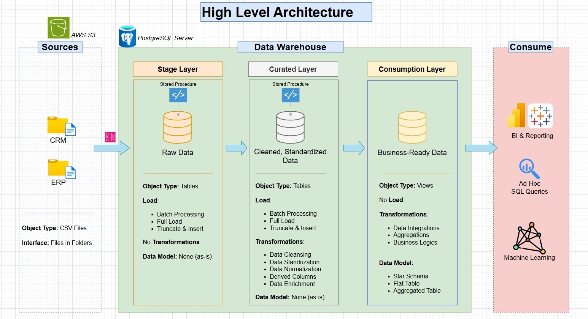
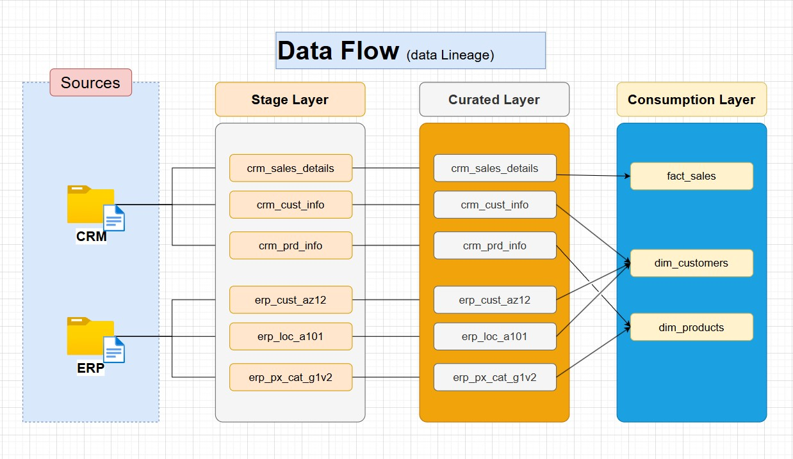
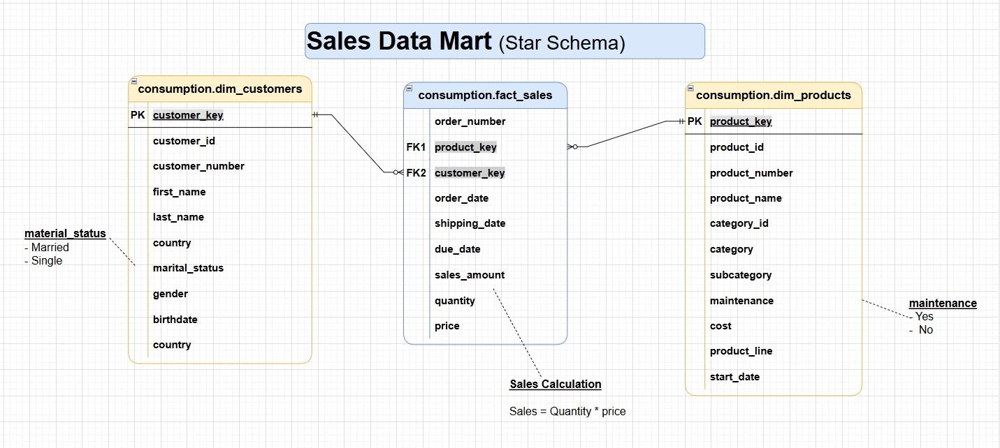

# Enterprise Data Warehouse – Sales Analytics

A modern enterprise data warehouse pipeline built using **PostgreSQL, Apache Airflow, and AWS S3** implementing a **multi-layer ETL architecture** with a **Sales Data Mart (Star Schema)** for analytics and reporting.

This project demonstrates real-world **data engineering practices**, including:

- Layered Data Warehouse Architecture
- ETL orchestration using Apache Airflow
- Dimensional data modeling (Star Schema)
- Raw → Curated → Business-ready transformations
- Data lineage and documentation

---

# High-Level Architecture

The warehouse follows a **three-layer architecture**:

- **Stage Layer** – Raw ingestion layer  
- **Curated Layer** – Cleaned and standardized data  
- **Consumption Layer** – Analytics-ready star schema  

---

# High-Level Architecture Diagram



---

Data flows from:


Source Systems → Stage → Curated → Consumption → BI / Analytics


---

# Data Sources

The warehouse integrates data from two enterprise systems.

---

## CRM System

Provides operational **customer and sales data**.

**Source files**

- `cust_info.csv`
- `prd_info.csv`
- `sales_details.csv`

**Data includes**

- Customer information
- Product details
- Sales transactions

---

## ERP System

Provides **reference and master data**.

**Source files**

- `CUST_AZ12.csv`
- `LOC_A101.csv`
- `PX_CAT_G1V2.csv`

**Data includes**

- Customer reference data
- Location details
- Product categories

---

# Data Flow Diagram



---

# Data Flow & Lineage

The following diagram shows how data moves through the warehouse layers.

## Flow Overview


Source Systems
↓
AWS S3 (CSV files)
↓
Stage Layer (Raw Tables)
↓
Curated Layer (Cleaned Tables)
↓
Consumption Layer (Star Schema)
↓
BI / Analytics / Machine Learning

---

# Consumption Layer Table Mapping



---

# Sales Data Mart (Star Schema)

The **Consumption Layer** exposes a **Sales Data Mart** designed using a **Star Schema**.

The model consists of:

- 1 Fact Table
- 2 Dimension Tables

---

# Fact Table – `fact_sales`

Represents **sales transactions**.

| Column | Description |
|------|-------------|
| order_number | Unique order ID |
| product_key | Foreign key to product dimension |
| customer_key | Foreign key to customer dimension |
| order_date | Date order was placed |
| shipping_date | Shipping date |
| due_date | Expected delivery date |
| sales_amount | Total sales value |
| quantity | Units sold |
| price | Unit price |

### Sales Calculation


sales_amount = quantity * price


### Grain

One record per **order transaction**.

---

# Dimension Table – Customers

## `dim_customers`

Contains **customer attributes**.

| Column | Description |
|------|-------------|
| customer_key | Surrogate key |
| customer_id | Source identifier |
| customer_number | Business identifier |
| first_name | Customer first name |
| last_name | Customer last name |
| country | Customer country |
| marital_status | Marital status |
| gender | Gender |
| birthdate | Date of birth |

### Example Values

**Marital Status**

- Married
- Single

---

# Dimension Table – Products

## `dim_products`

Contains **product attributes**.

| Column | Description |
|------|-------------|
| product_key | Surrogate key |
| product_id | Source identifier |
| product_number | Business product ID |
| product_name | Product name |
| category_id | Category ID |
| category | Product category |
| subcategory | Product subcategory |
| maintenance | Maintenance flag |
| cost | Product cost |
| product_line | Product line |
| start_date | Product availability start date |

### Example Values

**Maintenance**

- Yes
- No

---

# ETL Pipeline

The ETL workflow follows a **structured transformation pipeline**.

---

# Step 1 — Data Ingestion

Source CSV files are stored in:


AWS S3


Airflow loads them into the **Stage Layer**.

---

# Step 2 — Stage Layer

### Purpose

Raw landing zone for source data.

### Characteristics

- No transformations
- Data loaded as-is
- Batch processing
- Truncate + Insert

### Tables


- stage.crm_sales_details
- stage.crm_cust_info
- stage.crm_prd_info
- stage.erp_cust_az12
- stage.erp_loc_a101
- stage.erp_px_cat_g1v2


---

# Step 3 — Curated Layer

### Purpose

Clean and standardize raw data.

### Transformations

- Data cleansing
- Data normalization
- Standardization
- Derived columns
- Data enrichment

### Tables


curated.crm_sales_details
curated.crm_cust_info
curated.crm_prd_info
curated.erp_cust_az12
curated.erp_loc_a101
curated.erp_px_cat_g1v2


---

# Step 4 — Consumption Layer

Creates the **analytics-ready data mart**.

### Tables


consumption.fact_sales
consumption.dim_customers
consumption.dim_products


These are exposed through **views for BI consumption**.

---

# Airflow Orchestration

**Apache Airflow** orchestrates the ETL pipeline.

### Location


airflow/dags/


### Stage Loading DAGs


- load_crm_cust_info.py
- load_crm_prd_info.py
- load_crm_sales_details.py
- load_erp_cust_az12.py
- load_erp_loc_a101.py
- load_erp_px_cat_g1v2.py


### Generic Loaders


- s3_to_stage_crm_loader.py
- s3_to_stage_erp_loader.py


### Connection Tests


- test_postgres_connection.py
- test_s3_connection.py


### Responsibilities

- Data ingestion from S3
- Pipeline scheduling
- Dependency management
- Workflow orchestration

---

# Repository Structure

```
enterprise-datawarehouse-001
│
├── airflow
│ └── dags
│ └── stage
│
├── datasets
│ ├── source_crm
│ └── source_erp
│
├── docs
│ ├── data_catalog.md
│ ├── data_flow_diagram.jpg
│ ├── dim_fct_mapping.jpg
│ ├── high_level_architecture.jpg
│ └── naming_conventions.md
│
├── schema_stage
├── schema_curated
├── schema_consumption
│
├── README.md
└── LICENSE
```

---

# Technology Stack

| Component | Technology |
|----------|------------|
| Data Warehouse | PostgreSQL |
| Object Storage | AWS S3 |
| Orchestration | Apache Airflow |
| Processing | SQL Stored Procedures |
| Programming | Python |
| Data Modeling | Star Schema |
| Analytics | BI Tools / SQL |

---

# Use Cases

This warehouse supports:

- Sales performance analytics
- Customer segmentation
- Product performance insights
- BI dashboards
- Ad-hoc analytics queries
- Machine learning datasets

---

# Future Enhancements

Potential improvements:

- Incremental data loading
- Slowly Changing Dimensions (SCD)
- Data quality validation
- Metadata management
- Automated testing
- CI/CD pipeline

---

# License

MIT License

---

# Author

***Yaseen Ahamed***
- LinkedIn :  https://www.linkedin.com/in/ahamedyaseen0009/

---
